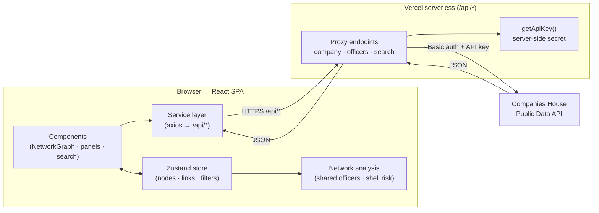
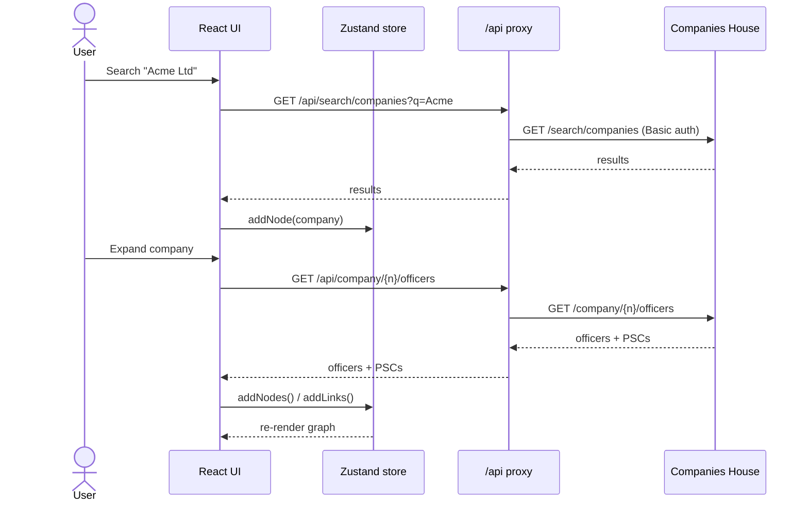

<div align="center">

# Companies House Explorer

**Interactive graph-based explorer for UK Companies House data** — search companies or officers, expand their relationships, and surface risk signals in connected company networks.

[](https://github.com/irfanbashir360/companies-house-explorer/actions/workflows/ci.yml)
[](./LICENSE)
[](https://react.dev/)
[](https://www.typescriptlang.org/)
[](https://vite.dev/)
[](https://d3js.org/)
[](https://vercel.com/)

**[Live demo →](https://companies-house-explorer.vercel.app)**

</div>

---

## Contents

- [Overview](#overview)
- [Screenshots](#screenshots)
- [Features](#features)
- [Architecture](#architecture)
- [Tech stack](#tech-stack)
- [Getting started](#getting-started)
- [How it works](#how-it-works)
- [Project structure](#project-structure)
- [Deployment](#deployment)
- [Contributing](#contributing)
- [Security](#security)
- [License](#license)

---

## Overview

The UK's [Companies House](https://developer.company-information.service.gov.uk/) publishes open data on every registered company, its officers, and its persons with significant control (PSCs). That data is rich but flat — hard to see how entities connect.

**Companies House Explorer** turns it into an explorable graph. Start from any company or officer, expand a node to pull in its relationships on demand, and let the app flag patterns worth a second look — officers shared across many companies, or shell-company risk indicators — directly on the network.

## Screenshots

| Hero view | Expanded network | Full interface |
| :---: | :---: | :---: |
|  |  |  |

## Features

- **Search** companies and officers directly against the Companies House API.
- **Interactive graph** — relationships rendered as a live, force-directed D3 network you can drag, zoom, and pan.
- **On-demand expansion** — expand a company to its officers and PSCs, or an officer to their active appointments; the graph grows only as you explore.
- **Detail panels** — inspect any node's underlying record and filter the graph by entity type (companies, officers, PSCs, charges, filings, establishments).
- **Network analysis** — client-side detection of officers shared across companies and lightweight shell-company risk scoring.
- **Export / import** — serialize the current graph to JSON and reload it later.

## Architecture

The browser never talks to Companies House directly. A thin serverless proxy injects the API key server-side, so the secret never reaches client code.



A typical search-and-expand cycle:



For a deeper walkthrough — state model, graph schema, and the analysis heuristics — see **[`docs/ARCHITECTURE.md`](./docs/ARCHITECTURE.md)**.

## Tech stack

| Layer | Choice |
| --- | --- |
| UI | React 19 + TypeScript |
| Build | Vite 7 |
| Graph rendering | D3.js 7 (force simulation) |
| State | Zustand |
| Styling | Tailwind CSS |
| HTTP | axios |
| Backend | Vercel serverless functions (API proxy) |

## Getting started

### Prerequisites

- Node.js 18+
- npm
- A [Companies House API key](https://developer.company-information.service.gov.uk/get-started)

### 1. Install dependencies

```bash
npm install
```

### 2. Configure environment variables

```bash
cp .env.example .env.local
```

Set your key in `.env.local`:

```bash
COMPANIES_HOUSE_API_KEY=your_api_key_here
```

- Keep the value as raw text (no quotes).
- Never commit `.env.local` — it is git-ignored.

### 3. Run the dev server

```bash
npm run dev
```

### 4. Build for production

```bash
npm run build
```

### 5. Lint

```bash
npm run lint
```

## How it works

- The frontend requests all data through `/api/*` — it never holds the API key.
- In **development**, the Vite dev-server proxy forwards `/api/*` to the local serverless handlers.
- In **production**, Vercel serverless routes proxy each request to the Companies House API, attaching the key with HTTP Basic auth.
- `api/_utils/getApiKey.ts` normalizes the key (trims quotes/newlines from dashboard copy-paste) and keeps it strictly server-side.

## Project structure

```text
companies-house-explorer/
├── api/                       # Vercel serverless proxy (keeps the API key server-side)
│   ├── company.ts             # /api/company/* → company profile, officers, PSCs
│   ├── officers.ts            # /api/officers/* → officer appointments
│   ├── search/                # /api/search/{companies,officers}
│   └── _utils/getApiKey.ts    # API key normalization + access
├── src/
│   ├── components/            # NetworkGraph (D3) + search, filter, info & analysis panels
│   ├── services/              # companiesHouse.ts — typed axios client for /api/*
│   ├── store/                 # graphStore.ts — Zustand graph/filter/history state
│   ├── utils/                 # networkAnalysis.ts — shared-officer & shell-risk heuristics
│   └── types/                 # shared TypeScript models (GraphNode, GraphLink, …)
├── docs/                      # ARCHITECTURE.md, screenshots, launch notes
├── .github/                   # issue/PR templates + CI workflow
└── DEPLOY.md                  # Vercel deployment guide
```

## Deployment

Deployed on Vercel. See the deployment checklist in **[`DEPLOY.md`](./DEPLOY.md)**.

## Contributing

Contributions are welcome. Please read **[`CONTRIBUTING.md`](./CONTRIBUTING.md)** and the **[`CODE_OF_CONDUCT.md`](./CODE_OF_CONDUCT.md)** before opening issues or pull requests.

## Security

The API key is never exposed to the browser. To report a vulnerability or review secret-handling expectations, see **[`SECURITY.md`](./SECURITY.md)**.

## License

Licensed under the MIT License. See **[`LICENSE`](./LICENSE)**.
