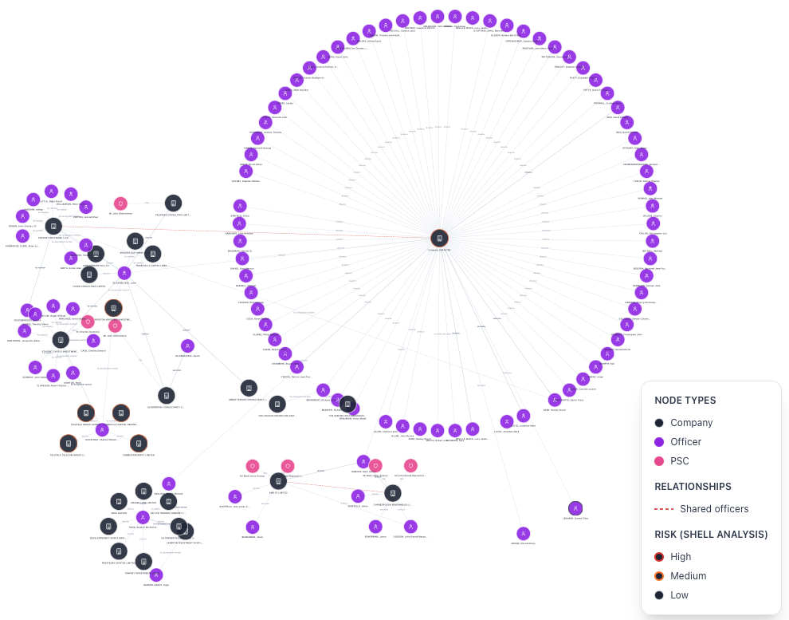
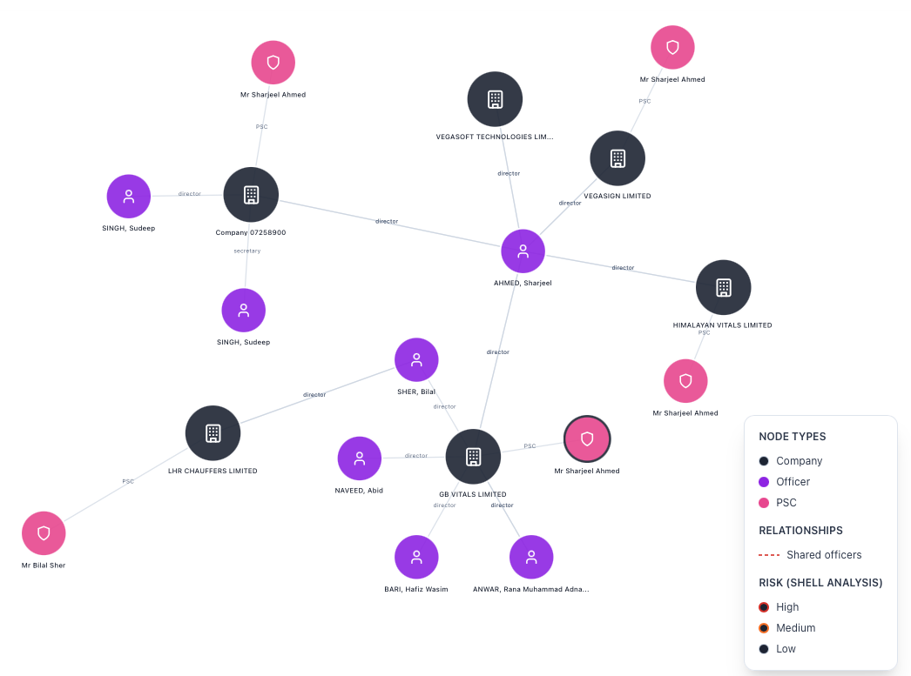
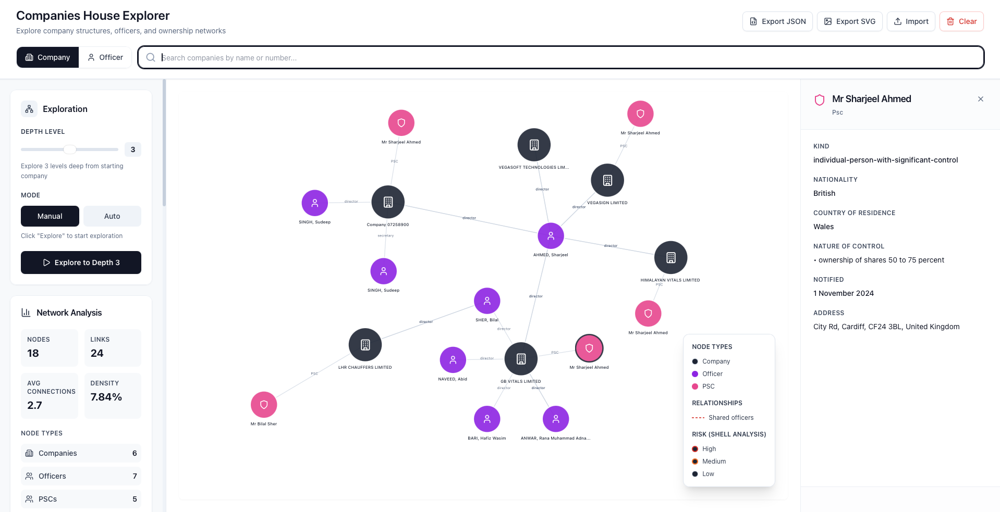

# Companies House Explorer

Interactive graph-based explorer for UK Companies House data. Search companies or officers, expand relationships, and analyze potential risk signals in connected company networks.

## Live Demo

`https://companies-house-explorer.vercel.app`

## Screenshots

### Hero View



### Expanded Network



### Full Interface



## Features

- Search companies and officers from Companies House.
- Visualize relationships as an interactive D3 network graph.
- Expand companies to officers and PSCs (persons with significant control).
- Expand officers to active company appointments.
- Inspect node details in side panels and filter graph entities.
- Run lightweight network analysis (shared officers, shell-risk indicators).

## Tech Stack

- React + TypeScript + Vite
- D3.js for graph rendering
- Zustand for state management
- Vercel serverless API proxy endpoints

## Getting Started

### Prerequisites

- Node.js 18+
- npm
- A Companies House API key

### 1) Install dependencies

```bash
npm install
```

### 2) Configure environment variables

Create a local env file:

```bash
cp .env.example .env.local
```

Set your key:

```bash
COMPANIES_HOUSE_API_KEY=your_api_key_here
```

Notes:

- Keep this value as raw text (no quotes).
- Never commit `.env.local`.

### 3) Start development server

```bash
npm run dev
```

### 4) Build for production

```bash
npm run build
```

## How It Works

- Frontend requests data through `/api/*`.
- In development, Vite proxy forwards requests.
- In production, Vercel serverless routes proxy to Companies House API.
- API key is kept server-side and never exposed to browser code.

## Project Structure

```text
src/                    # React app, graph UI, analysis panels, store
api/                    # Serverless proxy endpoints for Companies House API
api/_utils/getApiKey.ts # API key normalization and access helper
DEPLOY.md               # Deployment guide (Vercel)
```

## Deployment

See the deployment checklist in [`DEPLOY.md`](./DEPLOY.md).

## Contributing

Contributions are welcome. Please read [`CONTRIBUTING.md`](./CONTRIBUTING.md) before opening issues or pull requests.

## Security

Please review [`SECURITY.md`](./SECURITY.md) for reporting vulnerabilities and secret-handling expectations.

## License

This project is licensed under the MIT License. See [`LICENSE`](./LICENSE).
