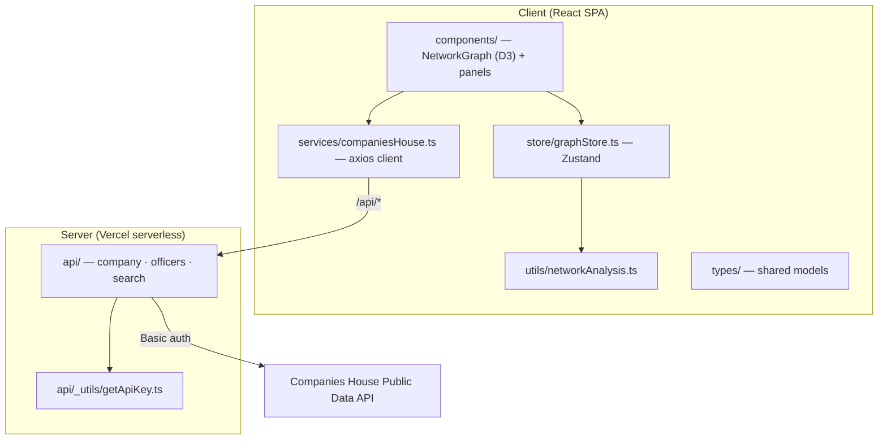
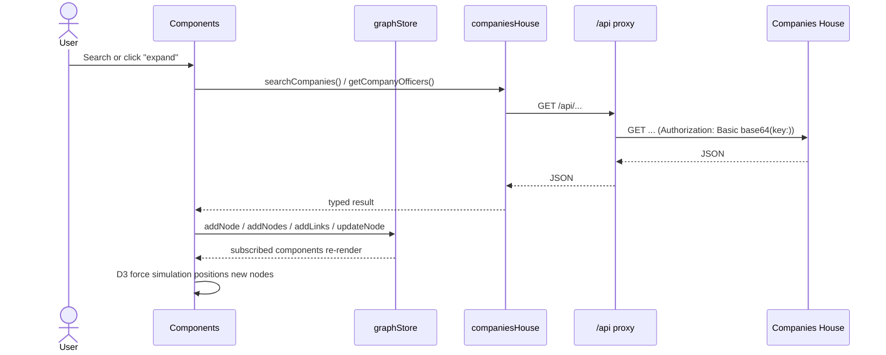

# Architecture

This document explains how Companies House Explorer is put together: the layers, the data model, the state store, the analysis heuristics, and the security boundary. For setup and scripts, see the [README](../README.md).

## Design goals

1. **Explore, don't dump.** The graph grows on demand — each expansion fetches only the neighbours of one node — so large corporate networks stay navigable.
2. **Never expose the API key.** The browser talks only to a same-origin `/api/*` proxy; the Companies House key lives server-side.
3. **Keep analysis client-side.** Once nodes are in the store, heuristics (shared officers, shell-risk) run in the browser against the in-memory graph — no extra round-trips.

## High-level layers



| Layer | Location | Responsibility |
| --- | --- | --- |
| Components | `src/components/` | Render the D3 graph and all side panels (search, filters, info, exploration, relationship & network analysis). |
| Store | `src/store/graphStore.ts` | Single Zustand store: graph data, selected node, filters, search history, loading, plus export/import and connection helpers. |
| Services | `src/services/companiesHouse.ts` | Typed `axios` client pointed at `/api`; one method per Companies House resource. |
| Analysis | `src/utils/networkAnalysis.ts` | Pure functions over the in-memory graph — no network calls. |
| Types | `src/types/` | Shared models (`GraphNode`, `GraphLink`, `GraphData`, API response shapes). |
| Proxy | `api/` | Serverless functions that attach the API key and forward to Companies House. |

## Data flow



## Graph data model

The graph is a set of typed nodes and directed links (`src/types/index.ts`):

```ts
type NodeType = 'company' | 'officer' | 'psc' | 'charge' | 'filing' | 'establishment';

interface GraphNode {
  id: string;          // e.g. "company-12345678" / "officer-abcd"
  label: string;
  type: NodeType;
  data: unknown;       // raw Companies House record
  expanded: boolean;   // guards against re-fetching the same node
  x?, y?, fx?, fy?;    // D3 simulation coordinates
}

interface GraphLink {
  source: string | GraphNode;
  target: string | GraphNode;
  type: string;        // relationship kind, e.g. "officer_of"
  label?: string;
}
```

- **Node ids are namespaced** (`company-…`, `officer-…`) so the analysis layer can tell entity kinds apart by prefix.
- `expanded` makes expansion idempotent — clicking an already-expanded node is a no-op.
- D3 mutates `source`/`target` from ids into node references during simulation, which is why links accept either form.

## State management

A single Zustand store (`graphStore.ts`) owns all shared state. Grouped responsibilities:

- **Graph** — `graphData`, `selectedNode`; actions `addNode`, `addNodes`, `addLink`, `addLinks`, `removeNode`, `updateNode`, `clearGraph`, `setGraphData`.
- **Filters** — a `FilterState` per node type; `setFilter`, `resetFilters`.
- **History** — recent searches; `addToHistory`, `clearHistory`.
- **Persistence** — `exportGraph()` / `importGraph()` serialize the graph to and from JSON.
- **Helpers** — `getNodeConnections(id)` returns the immediate neighbourhood, used by the relationship panels.

Components subscribe to the slices they need, so an expansion that appends nodes only re-renders the graph and affected panels.

## Network analysis

`utils/networkAnalysis.ts` runs entirely on the in-memory graph and returns a `NetworkAnalysis`:

- **Shared officers** — officers are grouped by normalized (lower-cased, trimmed) name; any name appearing on two or more companies yields a `SharedOfficerConnection` linking those companies.
- **Shell-company risk** — each company gets a `riskScore` and a `riskLevel` of `low` / `medium` / `high`, with human-readable `flags` explaining the score.
- **Summary stats** — totals for shared connections and high/medium-risk companies, surfaced in the analysis panel.

Because these are pure functions, they are deterministic and trivially testable, and they re-run instantly as the graph changes.

## Serverless proxy & security

- Every request from the client goes to `/api/*`; the frontend has no notion of the upstream host or key.
- Each `api/*` handler reads the key via `getApiKey.ts`, which trims quotes and stray newlines (common when pasting into a dashboard env field) and returns `null` if unset — in which case the handler responds `500 { error: "API key not configured" }` instead of calling upstream.
- The key is sent to Companies House as HTTP Basic auth: `Authorization: Basic base64("<key>:")`.
- `.env.local` is git-ignored; `.env.example` documents the single required variable.

## Environments

| Environment | `/api/*` handled by |
| --- | --- |
| Development | Vite dev-server proxy → local serverless handlers |
| Production | Vercel serverless functions |

Because the client always calls the same `/api` base URL, no build-time switch is needed between environments.

## Build & CI

- `npm run dev` — Vite dev server.
- `npm run build` — `tsc -b` type-check then `vite build`.
- `npm run lint` — ESLint (flat config).
- CI (`.github/workflows/ci.yml`) type-checks and builds on every push and pull request to `main`.

> **Known lint debt.** `npm run lint` currently reports ~26 errors — mostly
> `@typescript-eslint/no-explicit-any` on Companies House response payloads,
> one unused parameter, and one `react-hooks` "impure function during render"
> warning in `SearchHistory`. These are tracked as a follow-up and are why CI
> gates the type-check + build rather than lint for now.
